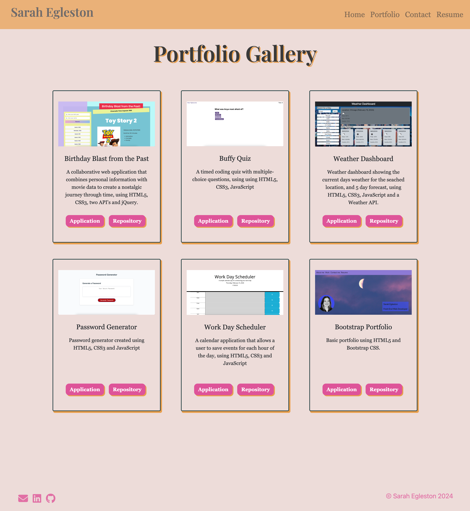

# Portfolio-React

## Description

Welcome to my portfolio! ✨

My portfolio is a web application project created with JavaScript, React, HTML5 and CSS3.

## How it works

- [Deployed Link](https://segleston.github.io/portfolio-react/)
- [GitHub Link](https://github.com/segleston/portfolio-react)

1. Home Page: showing name, a short bio and a head shot. There is also a navbar and footer which is shown on every page.

2. Project Gallery: showing six projects on six cards with their name, description, image and buttons with links to deployed apps and repos. When a specific card is clicked, the project details page is shown.

3. Project Detail: A page showing  more information about each project including images, description, technologies used, live link and source code link.

4. Contact Page: showing a form requesting name, email and message and a submit button. Also icons with email/github/linkedin.

## Technologies Used

- HTML5
- CSS3
- JavaScript
- Bootstrap
- React

## Credits

- Chris Kratz - TA
- [Bootstrap](https://getbootstrap.com/docs/5.3/getting-started/introduction/)
- [Icons/Favicon](https://icons8.com/icons)

## License

MIT License

Copyright (c) 2024 Sarah Egleston

Permission is hereby granted, free of charge, to any person obtaining a copy
of this software and associated documentation files (the "Software"), to deal
in the Software without restriction, including without limitation the rights
to use, copy, modify, merge, publish, distribute, sublicense, and/or sell
copies of the Software, and to permit persons to whom the Software is
furnished to do so, subject to the following conditions:

The above copyright notice and this permission notice shall be included in all
copies or substantial portions of the Software.

THE SOFTWARE IS PROVIDED "AS IS", WITHOUT WARRANTY OF ANY KIND, EXPRESS OR
IMPLIED, INCLUDING BUT NOT LIMITED TO THE WARRANTIES OF MERCHANTABILITY,
FITNESS FOR A PARTICULAR PURPOSE AND NONINFRINGEMENT. IN NO EVENT SHALL THE
AUTHORS OR COPYRIGHT HOLDERS BE LIABLE FOR ANY CLAIM, DAMAGES OR OTHER
LIABILITY, WHETHER IN AN ACTION OF CONTRACT, TORT OR OTHERWISE, ARISING FROM,
OUT OF OR IN CONNECTION WITH THE SOFTWARE OR THE USE OR OTHER DEALINGS IN THE
SOFTWARE.
